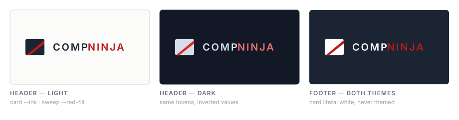
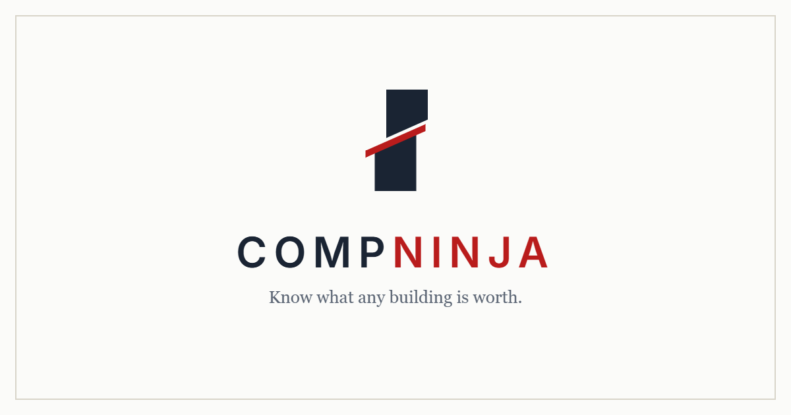

# CompNinja — Brand Sheet

One page. Who we are, what we sound like, what we may and may not say.

For fonts, colours, spacing, components and logo geometry, see
[DESIGN-SYSTEM.md](DESIGN-SYSTEM.md). This page is the half that document does
not cover: identity, voice, and the language rules that are not style choices
but promises.

---

## 1. Identity

| | |
|---|---|
| **Name** | CompNinja — one word, capital C, capital N. Never "Comp Ninja", never "Compninja". |
| **Legal entity** | CompNinja LLC, an Idaho limited liability company, file #6928558 |
| **Domain** | compninja.co (not `.com`) |
| **Public email** | info@compninja.co |
| **Copyright line** | © 2026 CompNinja LLC |
| **What it is** | A commercial real estate comp and valuation tool. Enter an address and a property type; get a value range, the comparable sales behind it, and where each one came from. |

The brand is the owner's own and independent. It previously carried Adler
Industrial branding — **do not reintroduce Adler anywhere.**

**The wordmark** sets `Comp` in ink and `Ninja` in red. That split is the only
place the name is ever coloured in two parts; in running copy it is one word in
one colour.

---

## 2. Positioning

**The promise:**

> A report you can hand to someone who will argue with it.

This stopped being the landing page's H1 on 2026-08-29, when the page went
broker-first. It is still the sentence the product is built to keep, and still
the test a new surface has to pass — it says what a report *is*, and that did
not change because the page that opened with it did.

**On the landing page, said broker-first:**

> Your closed deals, in every comp report you run.

> Upload your comp book once. Your own deals then sit inside your commercial
> real estate reports, badged as yours, beside public records and verified
> broker submissions. Nobody else sees them.

**Proof points, in the order the proof section uses them:** cited comps · about
a minute · every source disclosed.

The product's whole shape follows from that: it answers *and* proves. A number
with no evidence under it is off-brand even when it is correct.

**Audiences.** Brokers and small shops — broker, development and tenant-rep —
keeping a private book, and property owners asking what a building is worth.
The landing page leads with brokers; an owner's ways in are the BOV button
inside a report, the `/market/<slug>` pages and `/1031-exchange`. Both read the
same report; the difference is which side of it they are on.

---

## 3. Voice

**Plain, specific, and willing to say what it does not know.**

- Short declarative sentences. A figure, then what it rests on.
- Name the source. "County recorder," not "public data."
- Under-claim. The badges under-claim provenance, never over-claim; the copy
  works the same way.
- No hype adjectives, no exclamation marks, no "revolutionary," "powerful,"
  "seamless," "unlock the power of."
- Say the limitation in the same breath as the claim, not in a footnote.
  Honesty caveats have a protected place in every report summary.
- Sentence case for headings. The uppercase treatment is reserved for the
  micro-label (see the design system), never for prose.

**Serif means "this is the answer."** Headings and every dollar figure are set
in Georgia; everything that helps you read them is Inter. That typographic rule
is also a voice rule — it decides what counts as the answer on a page.

---

## 4. Language rules that are promises

These are not preferences. Each one is a claim about the business, and breaking
it is a compliance problem rather than a style slip.

**We are not a broker.** The owner is not licensed. Copy says we *connect you
with a licensed local broker* — never that we are one, never that we represent
anyone. The standing phrasing is "connect you with a licensed local broker who
knows your market."

**Every valuation is an automated estimate, never an appraisal.** The line
"An automated estimate, not an appraisal" appears on the report, the landing
page, the exports and the shared view. Do not delete it to tidy a layout, and
do not soften it to "estimate."

**"Verified" is a reserved word.** It names a badge only the server awards,
meaning a named broker vouched for that deal. Marketing copy, report prose and
model output may not use the word to mean "checked" or "accurate." The five
badge tiers are the vocabulary: **Verified · Public record · Listing · News ·
Estimate.**

**Co-branded, never white-label.** A member's own firm mark may sit on a
report; the CompNinja attribution and the automated-estimate line ride along
with it always. A report carrying only a brokerage's mark would read as that
brokerage's own appraisal. The attribution string is
"Prepared with CompNinja · an automated estimate, not an appraisal."

**A broker's archive does not make their searches cheaper.** Archive-first
retrieval floors the web-search budget when a broker's own vault is strong —
but it is gated on `PROVIDER.capabilities.searchBudget`, and the default
provider (Gemini) takes no `max_uses`, so **it is inert in production.** Copy
may say a broker's own comps appear inside their own reports, which is true and
provider-independent. It may not say they reduce, replace, skip or cheapen a
search. If the provider ever changes, this rule is retired deliberately, not
quietly. A test on the landing page rejects the phrasings.

**What leaves the vault, said in full.** Never "nothing leaves your vault."
Two doors exist and both are the member's own: publishing a comp into
CompNinja's public records, and sharing one with their firm. Separately, an
anonymized basis row travels on an invited or firm share. The standing phrasing
for what that row withholds is **"no address, no total price, no notes"** — not
"no price", because price per square foot times size implies the price, and
`comp-gate.js` names that trade-off where it builds the row.

**The public contact address is info@compninja.co** on every public surface —
never the owner's personal inbox, which is used for internal notifications
only.

---

## 5. Assets

### The mark

A navy rounded rectangle crossed by a red diagonal band, with the wordmark set
beside it — `Comp` in ink, `Ninja` in red. The mark is drawn in SVG in
`server.js`, not stored as an image, so it stays sharp at any size and changes
colour with the theme.

**Three appearances, two source constants.** The header mark is themed, so it
inverts between light and dark. The footer mark is a separate constant whose
card is literal white, because the footer slab is dark in *both* themes. They
differ by exactly one fill and cannot be merged — whichever you merged into
would break in the other context.

The sheet above uses literal hex rather than tokens, on purpose: it is a
picture of the marks, not a themed surface. Same exception the design system
makes for photographs.

### The files

Each preview below is the shipped file itself, so nothing here can drift from
what actually serves.

| | Asset | File | Size | Notes |
|---|---|---|---|---|
| | Header mark | `CN_LOGO` in `server.js` | vector | Drawn in SVG, themed |
| | Footer mark | `CN_LOGO_LIGHT` in `server.js` | vector | Always white — the slab is dark in both themes |
|  | Favicon | `favicon.svg` · `favicon.ico` · `favicon.png` | vector · 96×96 | Browser tab |
|  | iOS home screen | `apple-touch-icon.png` | 180×180 | |
|  | App icon | `icon-192.png` | 192×192 | PWA install |
|  | App icon | `icon-512.png` | 512×512 | PWA install |
|  | Maskable icon | `icon-maskable-512.png` | 512×512 | Safe-zone padded for Android |
|  | Link preview | `og-image.png` | 1200×630 | Shown when the site is shared |

**Core colours** — brand red `#B91C1C` (light) / `#F87171` (dark), ink
`#1A2433`, paper `#FBFBF9`. Always referenced as tokens (`var(--red)`), never
typed as hex. The full palette and the reason that rule has a trap in it:
DESIGN-SYSTEM.md §1 and §4.

---

## 6. Boilerplate

**One line:**
> CompNinja turns any commercial property address into a comp report — a value
> range, the comparable sales behind it, and a source for every one.

**Short (meta description length):**
> Enter any commercial property address and get recent sale and lease comps in
> under a minute. Free reports with maps, price per square foot, and PDF
> export.

**App store / manifest:**
> What is this building worth? Recent comparable sales and an automated value
> estimate for any US property address.

**Legal footer:**
> CompNinja is operated by CompNinja LLC, an Idaho limited liability company
> (file #6928558). Valuations are automated estimates, not appraisals.
> Comparables derive from publicly available sources. We connect you with local
> brokers for opinions of value.
